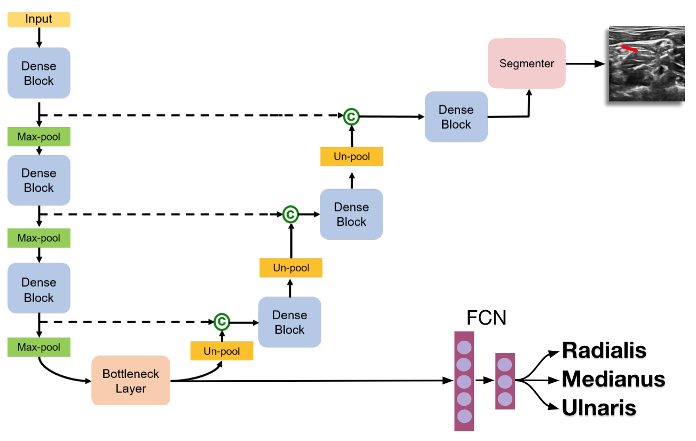
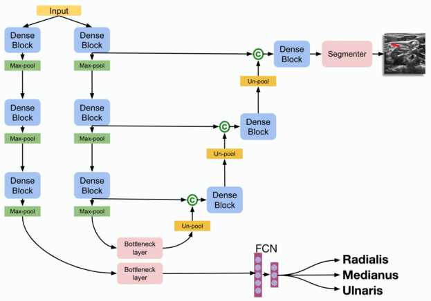

## Multitask Learning on Nerve Ultrasound Images

  

This repository contains several multi-task extensions of a U-Net model[1] to improve segmentation results on a small ultrasound nerve dataset. Our approaches were guided by TUM's chair for Computer Aided Medical Procedures. We applied multi-task learning[2] with a U-Net model to improve segmentation results on a very limited dataset. We implemented multiple architectures including hard parameter sharing using an FCN classifier at the U-net bottleneck, soft parameter sharing using cross-stitch networks[3] as well as a ResNet-18 benchmark classifier. Our classifiers used cross entropy loss and segmenters used dice loss. We experimented with several multitask loss approaches including linear weighting of classification and segmentation loss, uncertainty weighting[4] and loss scheduling[5].

## Networks

`model/quicknat.py` - Vanilla [QuickNAT](https://github.com/ai-med/QuickNATv2) architecture very similar to [U-Net](https://github.com/zhixuhao/unet) but adapted for fast brain image segmentation. This network serves as a benchmark for segmentation results.

`model/resultnet.py` - PyTorch [ResNet-18](https://github.com/pytorch/vision/blob/master/torchvision/models/resnet.py) adapted for nerve image classification. Similarly serves as a gold standard for classification results. Note that our multitask networks use an encoder + FCN classifier so we won't expect their accuracy to be as high as ResNet.

`model/quickfcn.py` - Hard parameter sharing model [2]: QuickNAT nerve segmentation network with a fully connected layer for nerve classification attached to bottleneck.

`model/softquickfcn.py` - Soft parameter sharing model [2]: QuickNAT nerve segmention network and a separate nerve classifier network with an identical encoder. Both networks are independently pretrained on their specific tasks. Encoders of both networks are then joined using Cross-stitch networks[3] for a second round of training.

## Dependencies

* [PyTorch](https://github.com/pytorch/pytorch) - Python deep learning library
* [Tensorboard](https://github.com/tensorflow/tensorboard) - Visualization of losses, metrics, segmentation results and confusion matrices.
* [polyaxon](https://github.com/polyaxon/polyaxon) - GPU cluster scheduling

## References

1. Abhijit Guha Roy, Sailesh Conjeti, Nassir Navab, Christian Wachinger  (2018). QuickNAT: Segmenting {MRI} Neuroanatomy in 20 seconds. CoRR
2. Sebastian Ruder (2017). An Overview of Multi-Task Learning in Deep Neural Networks, CVPR
3. Ishan Misra, Abhinav Shrivastava, Abhinav Gupta, Martial Hebert (2017). Cross-stitch Networks for Multi-task Learning, CVPR
4. Alex Kendall, Yarin Gal and Roberto Cipolla, Multi-Task Learning Using Uncertainty to Weigh Losses for Scene Geometry and Semantics, CoRR 2017
5. Sailesh Conjeti, Magdalini Paschali, Amin Katouzian, Nassir Navab (2017), Learning Robust Hash Codes for Multiple Instance Image Retrieval, MICCAI 2017
