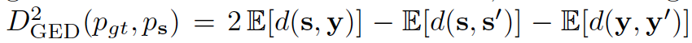
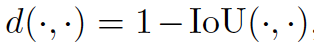
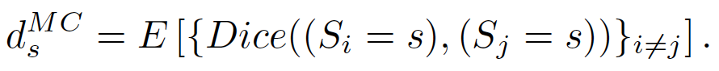
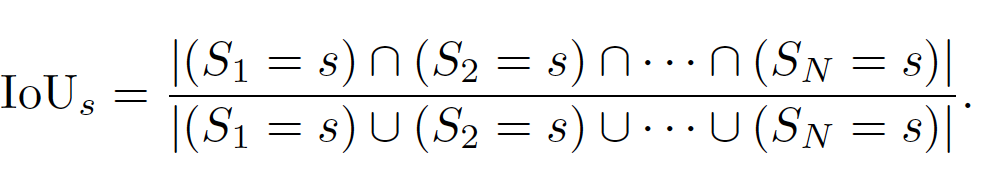
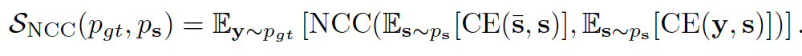

# Metrics

## Uncertainty Metrics

This metrics are supposed to qualify uncertainty in model outputs.
They usually work by taking two or more samples from model output space along with target image(s).
Some metrics measure relation between samples and targets while others measure relation between samples only.
A crucial thing to understand is **uncertainty metrics are not loss functions**.
One can select best model according to certain metrics but they are not intended to be used as part of the training pipeline.

Below are list of currently available uncertainty metrics.

#### Generalized Energy Distance (GED)
GED is a distance measure between samples and targets. It consists of 3 terms:

1. Average distance between samples and targets
2. Average distance between samples
3. Average distance between targets

[source]: PhiSeg paper [page 6]: https://arxiv.org/pdf/1906.04045.pdf
[source]: Probabilistic UNet paper [page 4]: https://arxiv.org/abs/1806.05034 

#### Samples Average Dice Score
Measures average dice score over generated samples. It's Type 2 Uncertainty Measurement from Bayesian QuickNAT paper.
It's calculated by computing dice score for all sample pairs and taking mean. 

[source] Bayesian QuickNAT paper [page 4-5]: https://arxiv.org/pdf/1811.09800.pdf

#### IoU Samples
Intersection over Union for all samples. It's Type 3 Uncertainty Measure from Bayesian QuickNAT paper.
Calculation starts by computing intersection and union of all samples and 
dividing number of active pixels in intersection by number of active pixels in union.

[source] Bayesian QuickNAT paper [page 4-5]: https://arxiv.org/pdf/1811.09800.pdf

#### Variance NCC
Average Normalized Cross Correlation between "Pixel-wise Cross Entropy of Samples" 
and "Pixel-wise Cross Entropy between Samples & Annotators".

where "s" is a sample, "s-bar" is a mean sample and  "y" is ground truth images.
"CE" stands for Cross-Entropy.

[source] PhiSeg paper [page 6]: https://arxiv.org/pdf/1906.04045.pdf
